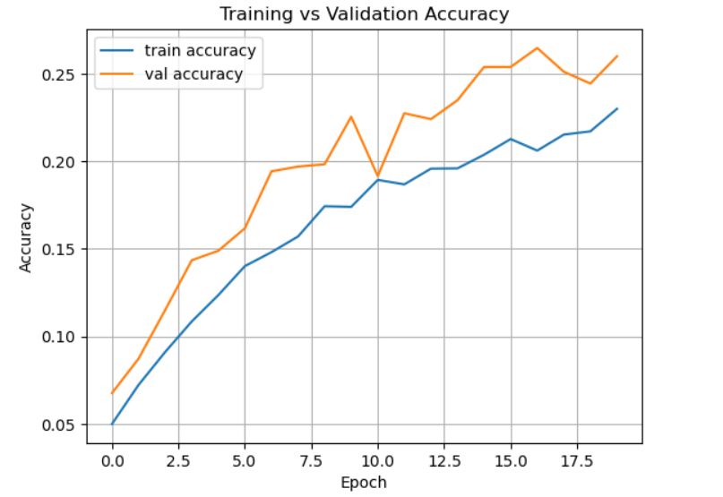

# 🐱 Pet Face Classification Using CNN

This project performs **image classification of pet faces** (cats and dogs) using a **Convolutional Neural Network (CNN)** trained on the [Oxford-IIIT Pet Dataset](https://www.robots.ox.ac.uk/~vgg/data/pets/). It demonstrates end-to-end model learning workflow from dataset preparation to training and evaluation.

---

## 📌 Project Overview

The goal is to train a CNN model to classify images of pets by breed using facial images. The project handles:
- Data download and preprocessing
- Training and validation
- Visualization of model performance

---

## 🗂️ Dataset

- **Source**: Oxford-IIIT Pet Dataset
- **Classes**: 37 pet breeds (cats and dogs)
- **Images**: ~7,000 labeled pet images

Images are organized automatically into subdirectories for training.

---

## 🛠️ Tech Stack

- **Language**: Python 3
- **Libraries**:
  - NumPy
  - Matplotlib
  - shutil, os, urllib

---

## 📈 Results
- **Accuracy Plo**t:

Training Accuracy: steadily increases

Validation Accuracy: plateaus early — shows signs of overfitting

---

